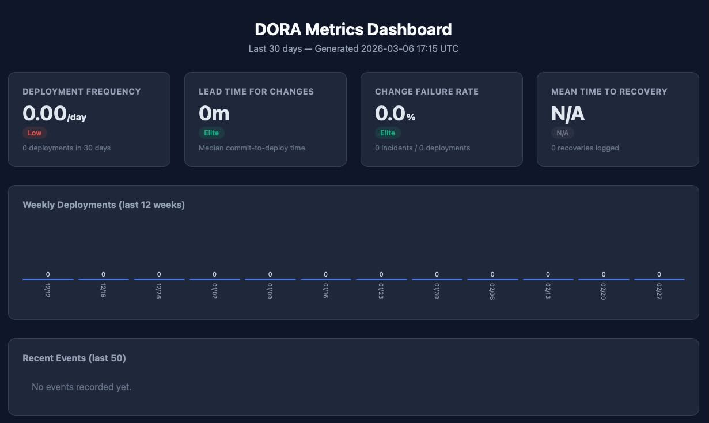

# DoraSkills

Track [DORA metrics](https://dora.dev/) in real-time directly from your development workflow using [Claude Code](https://docs.anthropic.com/en/docs/claude-code) hooks and skills.

## What are DORA Metrics?

DORA (DevOps Research and Assessment) defines 4 key metrics that measure software delivery performance:

| Metric | What it measures | Elite | High | Medium | Low |
|---|---|---|---|---|---|
| **Deployment Frequency** | How often you deploy to production | Multiple/day | Daily to weekly | Weekly to monthly | < Monthly |
| **Lead Time for Changes** | Time from commit to production | < 1h | 1h - 1 day | 1 day - 1 week | > 1 week |
| **Change Failure Rate** | % of deployments causing incidents | 0-5% | 5-10% | 10-15% | > 15% |
| **Mean Time to Recovery** | Time to recover from an incident | < 1h | < 1 day | < 1 week | > 1 week |

## How It Works

DoraSkills uses two Claude Code mechanisms:

- **Hooks** — A `PostToolUse` hook automatically intercepts `git commit` and deployment commands (`docker push`, `kubectl apply`, `helm upgrade`, etc.) to log events without any manual action.
- **Skills** — Slash commands (`/dora-status`, `/dora-log-deploy`, etc.) let you manually log events and visualize metrics.

All events are stored locally in a single JSON file (`data/dora-events.json`). No external service required.

## Prerequisites

- [Claude Code](https://docs.anthropic.com/en/docs/claude-code) CLI installed
- Python 3.7+ (for the dashboard generator — uses only the standard library)
- Git

## Quick Start

### Option 1: Use directly in this project

```bash
git clone <this-repo-url>
cd DoraSkills
claude
```

The hooks and skills are already configured. Start working and your DORA events will be tracked automatically.

### Option 2: Initialize in an existing project

Copy the DoraSkills configuration into your own project:

```bash
claude
# Then inside Claude Code:
/dora-init
```

This copies the hook, settings, and skills into your project's `.claude/` directory.

## Available Commands

Run these inside a Claude Code session:

| Command | Description | Example |
|---|---|---|
| `/dora-status` | Display DORA metrics summary (last 30 days) | `/dora-status` |
| `/dora-dashboard` | Generate an interactive HTML dashboard | `/dora-dashboard` |
| `/dora-log-deploy` | Manually log a deployment | `/dora-log-deploy production v2.1.0` |
| `/dora-log-incident` | Log an incident | `/dora-log-incident API down - critical` |
| `/dora-log-recovery` | Log a recovery (calculates MTTR) | `/dora-log-recovery evt_003` |
| `/dora-init` | Initialize tracking in a new project | `/dora-init` |

## Automatic Tracking

The hook automatically captures:

- **Git commits** — hash, message, author, branch, and Jira IDs extracted from the message (e.g., `PROJ-123`)
- **Deployments** — detected from `docker push`, `docker-compose up`, `kubectl apply`, `kubectl rollout`, `helm upgrade`

The hook runs **asynchronously** so it never blocks your workflow.

## Project Structure

```
DoraSkills/
├── .claude/
│   ├── settings.json              # Hook configuration
│   ├── hooks/
│   │   └── dora-tracker.sh        # PostToolUse hook (auto-tracking)
│   └── skills/
│       ├── dora-status/           # /dora-status
│       ├── dora-dashboard/        # /dora-dashboard + Python generator
│       ├── dora-log-deploy/       # /dora-log-deploy
│       ├── dora-log-incident/     # /dora-log-incident
│       ├── dora-log-recovery/     # /dora-log-recovery
│       └── dora-init/             # /dora-init
├── data/
│   └── dora-events.json           # Event storage
├── CLAUDE.md                      # Project conventions for Claude Code
└── README.md
```

## Event Format

Events are stored in `data/dora-events.json`:

```json
{
  "events": [
    {
      "id": "evt_001",
      "type": "commit",
      "timestamp": "2026-03-05T10:30:00Z",
      "data": {
        "hash": "abc123",
        "message": "fix: login bug [PROJ-123]",
        "author": "user",
        "jira_ids": ["PROJ-123"],
        "branch": "main"
      }
    },
    {
      "id": "evt_002",
      "type": "deployment",
      "timestamp": "2026-03-05T11:00:00Z",
      "data": {
        "environment": "production",
        "version": "v2.1.0",
        "commit_ids": ["abc123"],
        "method": "docker-push"
      }
    }
  ]
}
```

## Dashboard

Run `/dora-dashboard` to generate an interactive HTML page with:

- Metric cards with DORA classification (Elite/High/Medium/Low)
- Weekly deployment frequency bar chart (last 12 weeks)
- Recent events timeline
- Dark theme, no external dependencies

The dashboard is generated as a standalone HTML file at `data/dora-dashboard.html`.

The dashboad looks like:


## Metrics Calculation

- **Deployment Frequency**: count of deployments / 30 days
- **Lead Time for Changes**: median time between the earliest linked commit and the deployment
- **Change Failure Rate**: incidents / deployments x 100
- **MTTR**: median of all `mttr_minutes` values from recovery events

Metrics use **median** (not mean) for robustness against outliers.

## Contributing

1. Fork this repository
2. Create a feature branch (`git checkout -b feature/my-feature`)
3. Commit your changes
4. Push to the branch and open a Merge Request

## License

MIT
